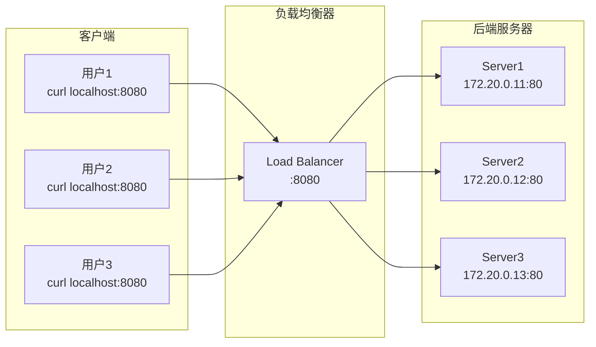
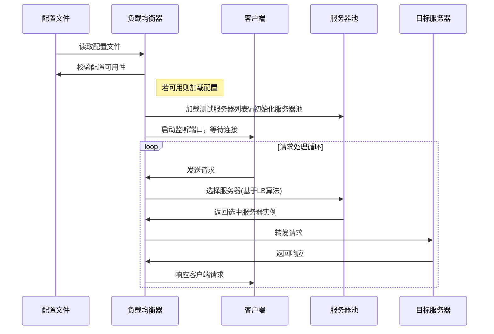

# 负载均衡器简介

使用 C 语言实现负载均衡器，负载均衡器是一种软件系统，用于在多个服务器之间智能分配传入的网络流量和请求。它的核心目标是优化资源使用、最大化吞吐量、减少响应时间，并避免任何单一服务器过载。

## 什么是负载均衡器

负载均衡器就像一个**交通指挥员**，站在用户和服务器之间，把用户的请求分发到多台服务器上。

```plain&#x20;text
没有负载均衡器：                  有负载均衡器：

    用户1 ─┐                         用户1 ─┐
    用户2 ─┼─→ 服务器（压力山大）      用户2 ─┼─→ 负载均衡器 ─┬→ 服务器1
    用户3 ─┤                         用户3 ─┤              ├→ 服务器2
    用户4 ─┘                         用户4 ─┘              └→ 服务器3
```

### 负载均衡器核心职责

### 生活中的例子

**银行柜台：**

```plain&#x20;text
        ┌→ 1号窗口（空闲）← 分配到这里
顾客 → 叫号机 
        ├→ 2号窗口（忙碌）
        └→ 3号窗口（暂停服务）← 跳过
```

叫号机就是负载均衡器：

* 看哪个窗口空闲

* 跳过暂停服务的窗口

* 让顾客均匀分布

### 核心流程

```plain&#x20;text
1. 用户发请求 → 负载均衡器
2. 负载均衡器选一台服务器（轮询/最少连接等）
3. 把请求转发给选中的服务器
4. 服务器处理完返回给负载均衡器
5. 负载均衡器返回给用户
```

### 常见的负载均衡器

***

## 架构图



## 项目实现基本流程

1. 初始化配置文件，监测配置文件可用性，如果可用则加载配置文件
2. 启动监听端口，等待客户端连接
3. 配置文件如果有测试服务器列表，则将服务器加入到服务器池中
4. 监听客户端请求，收到请求后根据负载均衡算法选择一台服务器
5. 将请求转发给选中的服务器，并等待服务器响应
6. 将服务器响应返回给客户端
7. 循环步骤4-6，直到程序退出

### 时序图



***

# 模块

## 第一步：docker 生成虚拟服务器模拟。创建测试环境（Docker）

### 1.1 安装 Docker

```bash
# Ubuntu 22.04 安装 Docker
sudo apt update
sudo apt install -y docker.io docker-compose
sudo systemctl start docker
sudo systemctl enable docker
sudo usermod -aG docker $USER
newgrp docker
```

### 1.2 创建项目目录

```bash
mkdir -p ~/load_balancer_test
cd ~/load_balancer_test
```

### 1.3 创建后端服务器镜像

```bash
# 创建 server 目录
mkdir -p server
```

**server/server.py** - 简单的 HTTP 服务器：

```python
#!/usr/bin/env python3
from http.server import HTTPServer, BaseHTTPRequestHandler
import os
import socket
import json
from datetime import datetime

SERVER_NAME = os.environ.get('SERVER_NAME', 'Unknown')
SERVER_PORT = int(os.environ.get('SERVER_PORT', '80'))


class Handler(BaseHTTPRequestHandler):
    def do_GET(self):
        response = {
            'server': SERVER_NAME,
            'hostname': socket.gethostname(),
            'ip': socket.gethostbyname(socket.gethostname()),
            'path': self.path,
            'time': datetime.now().isoformat(),
            'message': f'Hello from {SERVER_NAME}!'
        }

        self.send_response(200)
        self.send_header('Content-Type', 'application/json')
        self.send_header('X-Server', SERVER_NAME)
        self.end_headers()
        self.wfile.write(json.dumps(response, indent=2).encode())

    def log_message(self, format, *args):
        print(f"[{SERVER_NAME}] {args[0]}")


if __name__ == '__main__':
    server = HTTPServer(('0.0.0.0', SERVER_PORT), Handler)
    print(f'{SERVER_NAME} running on port {SERVER_PORT}')
    server.serve_forever()
```

**server/Dockerfile**：

```dockerfile
FROM python:3.11-slim
WORKDIR /app
COPY server.py .
CMD ["python", "server.py"]
```

### 1.4 创建 docker-compose.yml

```yaml
version: '3.8'

services:
  server1:
    build: ./server
    container_name: backend_server1
    environment:
      - SERVER_NAME=Server1
      - SERVER_PORT=80
    ports:
      - "8081:80"    # 添加端口映射
    networks:
      lb_network:
        ipv4_address: 172.20.0.11

  server2:
    build: ./server
    container_name: backend_server2
    environment:
      - SERVER_NAME=Server2
      - SERVER_PORT=80
    ports:
      - "8082:80"    # 添加端口映射
    networks:
      lb_network:
        ipv4_address: 172.20.0.12

  server3:
    build: ./server
    container_name: backend_server3
    environment:
      - SERVER_NAME=Server3
      - SERVER_PORT=80
    ports:
      - "8083:80"    # 添加端口映射
    networks:
      lb_network:
        ipv4_address: 172.20.0.13

networks:
  lb_network:
    driver: bridge
    ipam:
      config:
        - subnet: 172.20.0.0/16
```

### 1.5 启动后端服务器

```bash
cd ~/load_balancer_test
docker-compose up -d --build

# 验证服务器运行
docker ps
curl http://172.20.0.11
curl http://172.20.0.12
curl http://172.20.0.13
```

## 配置文件模块

## 服务加载模块

1. 支持从配置文件加载服务器列表 & 通过 agent 注册服务器

## 连接池模块

2. 连接池模块: 建立tcp连接池，复用连接，减少连接建立开销

## 心跳检查模块

当服务器建立连接后，定期发送心跳包检测服务器健康状态

## 服务注册模块


## 服务发现模块

## 算法模块

负载均衡算法模块：根据对应的算法选择服务器

# 优化

1. 配置文件重载

2. 限流器

3. 服务注册与发现

4. 健康检查机制

5. 连接池管理

6. 熔断

7. QPS提升： 每一连接一个线程，线程池，单线程 epoll,多线程 epoll

8. 监控与指标收集

